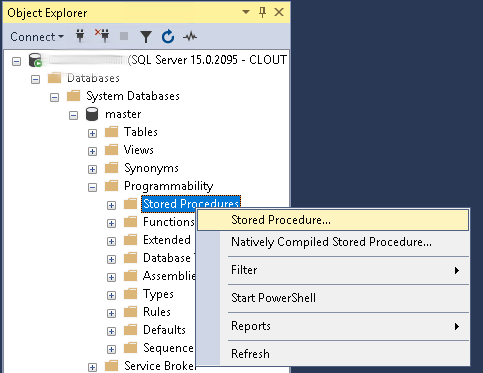
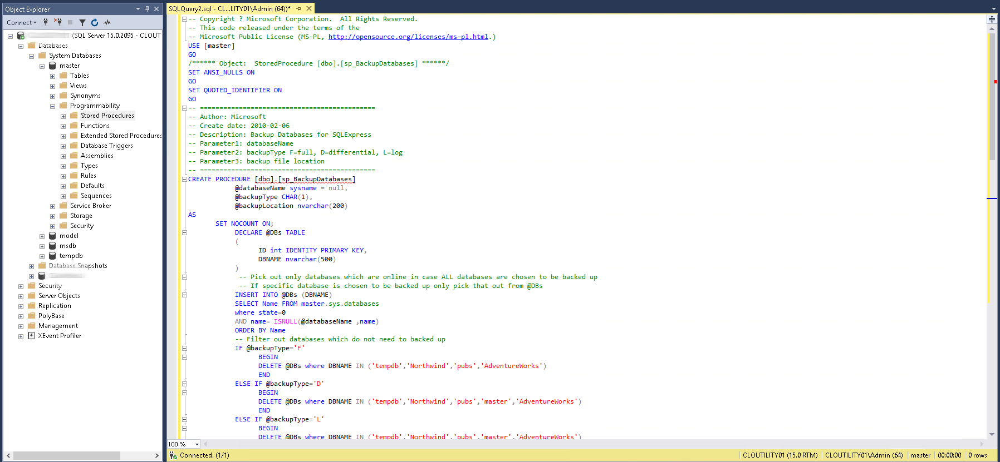

# Backup Microsoft SQL Express Server
Small Batch Script that dumps all Microsoft SQL Express databases before it starts a Spectrum Protect (TSM) Backup

## Microsoft SQL Express Configuration
Before we can backup the database you need to create **SQL Stored Procedures** under Databases > System Databases > master > Programmability. Right-click it and click **New Stored Procedure**



In the SQLQuery window, copy all the content in this [SQL Express Backups](script/SQLExpressBackup.sql) script provided by [Microsoft own Documentation](https://docs.microsoft.com/en-us/troubleshoot/sql/admin/schedule-automate-backup-database), then click Execute button above. It will create a sp_BackupDatabases stored procedure in your master database, this will be used to be able to backup all the databases.



## Spectrum Protect Configuration
Create a catalog where you want to locate your database backups. 
In that location can you create 2 directories (bin and logs). Copy the BackupSQL.cmd file to the bin directory.

Open the [BackupSQL.cmd](script/BackupSQL.cmd) file in your favorit text editor and modify the first few lines.

```
set DSM_DIR=C:\Program Files\Tivoli\TSM\baclient
set BACKUP_LOCATION=D:\SQL Backup
```

First line is the path where you have installed IBM Spectrum Protect Backup-Archive Client and where the dsmc command are located. (Default is: C:\Program Files\Tivoli\TSM\baclient)

The second line is where you want to save your database backups. 

When this is done, open dsm.opt file and add following line.

```
PRESCHEDULECMD "<MS SQL Backup Location>\bin\SQLBackup.cmd"
```